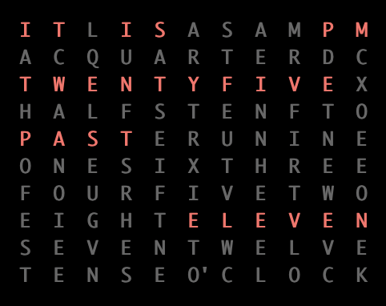

# QLOCKTWO

Credits to [**QLOCKTWO**](https://www.qlocktwo.com) for their amazing clocks, a real beauty in your office or home.

This repository is a collection of such a clock, limited to show time.

## VT100
Insprired on the real QLOCKTWO, this repository represents a **python3** implementation using [`curses`](https://en.wikipedia.org/wiki/Curses_%28programming_library%29) and therefore usable on any system. The code outputs [`VT100`](https://vt100.net) codes for display.

## "Showtime"




There are four language versions (`NL`, `DE`, `FR` and `EN`) and it is easy enough to generate more by changes two dictionaries.

## Run a clock

```
$ python3 -m world_clock_ii_NL.py
```


___


